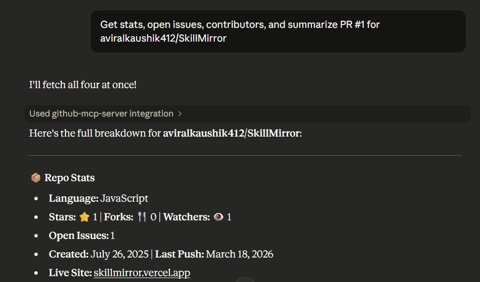
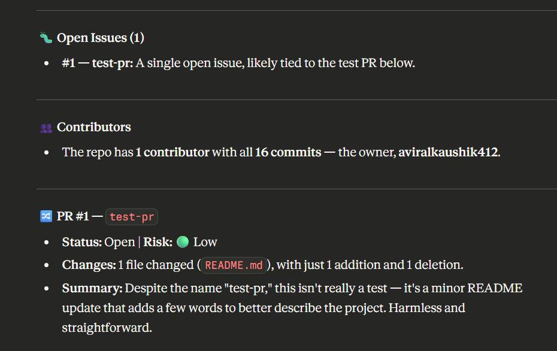
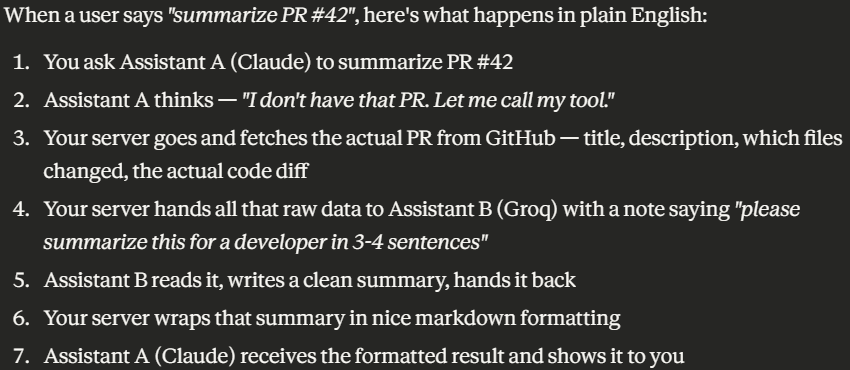

# 🤖 GitHub MCP Server — Your AI-Powered GitHub Assistant

> Ask Claude anything about a GitHub repo — and it actually *does it*.


---

## What is this?

This is a **Model Context Protocol (MCP) server** that connects Claude AI directly to the GitHub API.

Instead of copy-pasting repo links and asking Claude to "analyze this", you just talk to Claude naturally:

> *"Get the stats for facebook/react"*
> *"Find good first issues in microsoft/vscode"*
> *"Summarize PR #42 for vercel/next.js"*

And Claude calls the right tool, fetches live data from GitHub, and gives you a clean, formatted answer — all inside Claude Desktop.

No browser switching. No manual copy-paste. Just ask.

---

## Tools Available

| Tool | What it does |
|------|-------------|
| `get_repo_stats` | Stars, forks, language, license, last push — everything at a glance |
| `get_open_issues` | Lists open issues with labels, age, and comment count |
| `get_contributors` | Top contributors ranked by commits, with percentage insights |
| `summarize_pull_request` | Fetches PR diffs and generates an AI summary with risk level |
| `find_good_first_issues` | Finds beginner-friendly issues filtered by label — great for open source contributions |

---

## How it works

```
You (in Claude Desktop)
        ↓
   Claude AI
        ↓
  MCP Server (this project)
        ↓
   GitHub REST API  +  Groq AI
        ↓
  Formatted response back to Claude
```

When you ask Claude about a repo, it calls one of the tools registered in this server. The server fetches data from GitHub, optionally runs it through Groq for AI summaries, formats everything into clean markdown, and sends it back to Claude to show you.

---

## Tech Stack

- **Runtime** — Node.js + TypeScript
- **MCP SDK** — `@modelcontextprotocol/sdk` (connects to Claude Desktop)
- **GitHub API** — via `axios` with token auth
- **AI Summaries** — Groq API (fast, free tier available)
- **Config** — `dotenv` for environment variables

---

## Project Structure

```
src/
├── server.ts              # Entry point — wires up the MCP server
├── tools/
│   ├── registry.ts        # Tool registry — all tools defined and dispatched here
│   ├── issues.ts          # Open issues logic
│   ├── contributors.ts    # Contributors logic
│   ├── pullRequest.ts     # PR fetch + AI summary
│   └── goodFirstIssues.ts # Beginner issue finder
├── services/
│   ├── githubService.ts   # Shared GitHub axios client
│   └── aiService.ts       # Groq AI summarization
└── utils/
    └── formatters.ts      # Markdown formatters for all tool responses
```

---

## Getting Started

### 1. Clone and install

```bash
git clone https://github.com/aviralkaushik412/github-mcp-server
cd github-mcp-server
npm install
```

### 2. Set up environment variables

Create a `.env` file in the root:

```env
GITHUB_TOKEN=your_github_personal_access_token
GROQ_API_KEY=your_groq_api_key
```

- Get a GitHub token at [github.com/settings/tokens](https://github.com/settings/tokens) — needs `repo` scope
- Get a free Groq key at [console.groq.com](https://console.groq.com)

### 3. Connect to Claude Desktop

Open your Claude Desktop config file:

- **Mac:** `~/Library/Application Support/Claude/claude_desktop_config.json`
- **Windows:** `%APPDATA%\Claude\claude_desktop_config.json`

Add this:

```json
{
  "mcpServers": {
    "github-mcp-server": {
      "command": "npx",
      "args": ["ts-node", "/absolute/path/to/src/server.ts"]
    }
  }
}
```

### 4. Restart Claude Desktop and start asking

```
"Get stats for torvalds/linux"
"Find good first issues in facebook/react"
"Summarize PR #1 for aviralkaushik412/SkillMirror"
```

---

## Screenshots

### Repo Stats


### PR Summary with AI


### Current working


---

## What I learned building this

This project taught me a lot about how AI models actually work *with* tools — not just answering questions from memory, but taking actions and fetching real-time data.

A few things that were genuinely tricky:
- MCP servers communicate over **stdout as a JSON stream** — one stray `console.log()` breaks everything silently
- Claude decides *which* tool to call based on the tool's `description` field — so wording matters a lot
- Structuring responses as clean markdown makes Claude's output dramatically better

---

## Coming Soon

- [ ] `explain_repository` — AI-generated plain-English explanation of what any repo does
- [ ] `analyze_pr_risk` — flags high-risk PRs based on file count, diff size, and sensitive paths
- [ ] React dashboard frontend for non-Claude-Desktop users

---

## Resume Bullet Points

If you're here from my resume, here's the one-liner version:

> Built a production-ready Model Context Protocol (MCP) server in TypeScript that connects Claude AI to the GitHub REST API and Groq AI, enabling natural language queries over live repository data via 5 registered tools with structured error handling, formatted markdown responses, and a tool registry pattern.

---

## Author

**Aviral Kaushik**
[github.com/aviralkaushik412](https://github.com/aviralkaushik412)

---

*Built with Claude Desktop, TypeScript, and a lot of stderr debugging.*